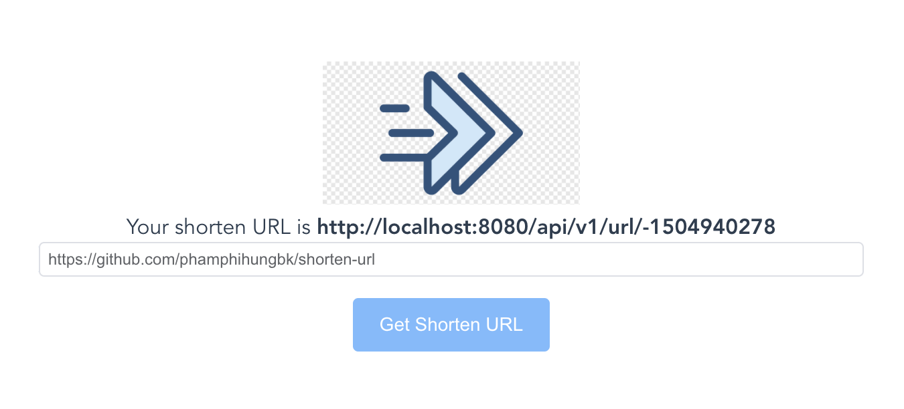
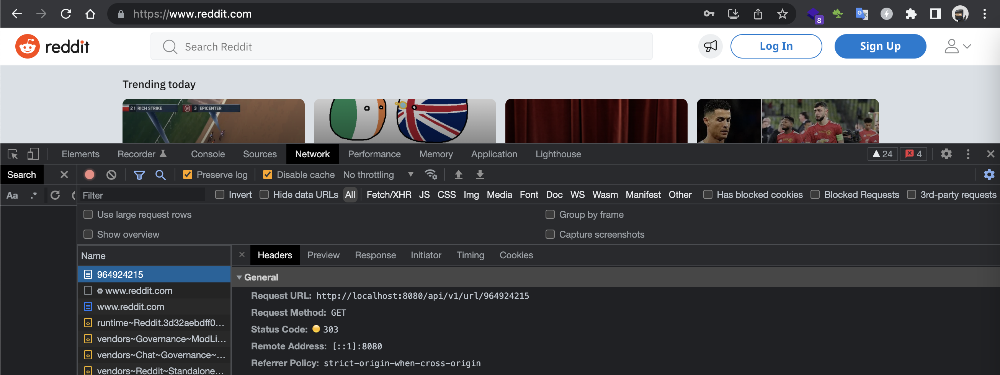
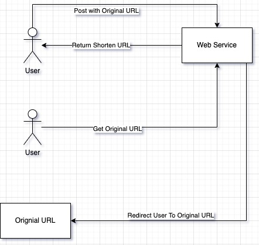

## 🔥Small Clone TinnyURL project built by Java

### Features:

- Cassandra
- Java
- Maven
- Spring Boot


### Guidelines:

Run `make up` to start cassandra container

Run sql statement below in cassandra container to create keyspace
```sql
CREATE
KEYSPACE shorturl WITH REPLICATION = {'class': 'SimpleStrategy', 'replication_factor': 1};
```

Run `make start` to start server

Post request
```
curl --location --request POST 'http://localhost:8080/api/v1/url/' \
--header 'Content-Type: application/json' \
--data-raw '{
    "originalUrl": "https://www.reddit.com"
}'
```

Get all request
```
curl --location --request GET 'http://localhost:8080/api/v1/url/'
```

Set up pre commit
```
cp scripts/pre-commit .git/hooks/ && chmod +x .git/hooks/pre-commit && echo 'hook copied'
```

### Demo
Web app will redirect to original URL with shorten URL


### Flow

